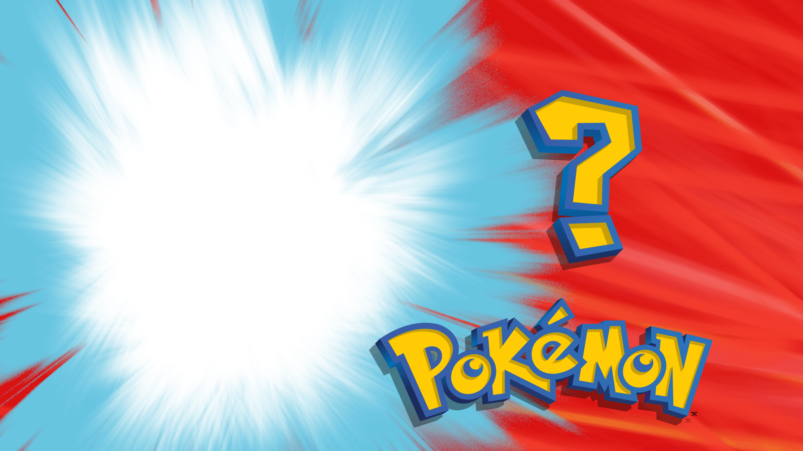
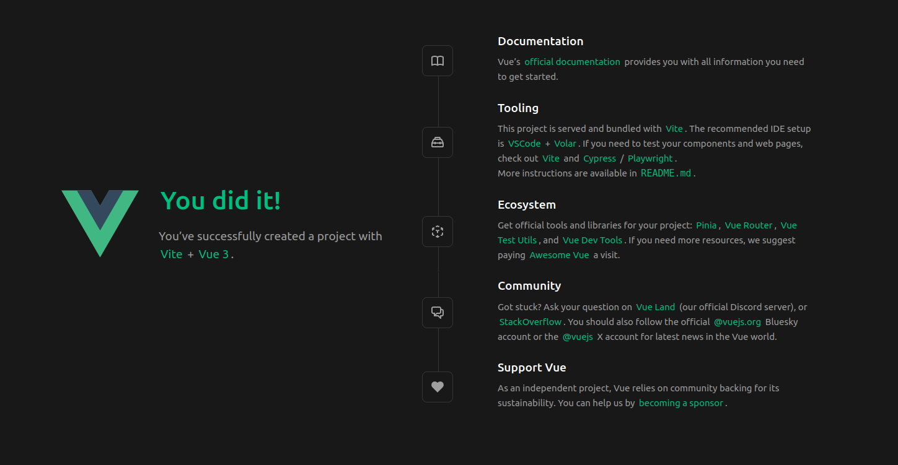
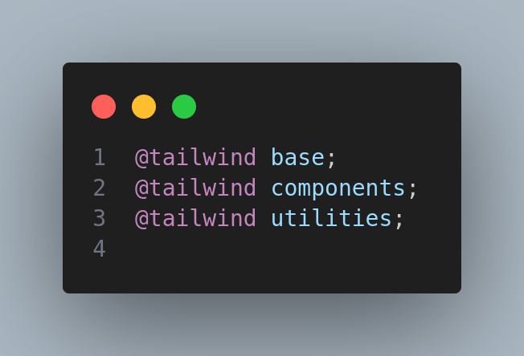
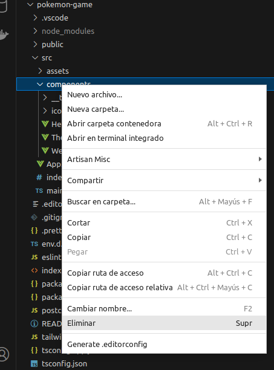
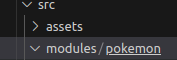
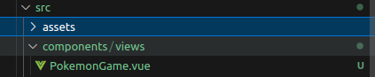
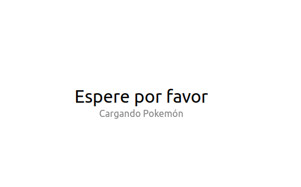
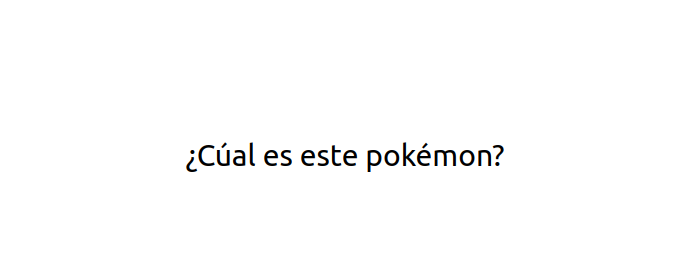

<div align="justify">

# Adivina el pokémon

> ✒️ __Autor__:  Nabil L.A. ([@nalleon](https://github.com/nalleon)) 

Repositorio dedicado a un pequeño proyecto del módulo de DAD acerca de adividar un pokémon.

<div align="center">

</div>

## Índice
- [Reto 01](#reto-01)
  - [Configuración de Vue](#configuración-vue)
  - [Limpieza del proyecto](#limpieza-del-proyecto)
  - [Implementación de Tailwind CSS](#implementación-de-tailwind-css)
- [Reto 02](#reto-02)
- [Extra](#extra)

<div align="center">

[](https://pokemondb.net/pokedex/tyranitar)
[](https://pokemondb.net/pokedex/hydreigon)
[](https://pokemondb.net/pokedex/arcanine)
</div>


## Retos

### Reto 01

#### Configuración Vue

En primer lugar configuraremos nuestro proyecto de Vue. En la siguiente imagen tenemos la configuración seleccionada:

***

<br>

<div align="center" border="1px">

</div>

***

<br>

> ❓ ¿Para qué sirve Vue Router, Pinia, Vitest, ESLint y Prettier?

-  Vue Router: Una biblioteca oficial de Vue.js que nos permite tanto definir como manejar diferentes rutas, facilitando así la creacion de aplicaciones de aplicaciones de una sola página (SPA).

- Pinia: Una librería que se encarga de eliminar la complejidad.

- Vitest: Un framework de testing moderno para typescript.

- ESLint: Un plugin para comprobar los template y script de los archivos .vue.

- Prettier: Un formateador automático de código.

***

<br>

Tras esto realizaremos los comandos mencionados anteriormente para comprobar que nuestra aplicación haya sido creada correctamente.

```bash
  npm install
  npm run format
  npm run dev
```

<div align="center" border="1px">


</div>


***

<br>

> ❓ ¿Qué es Composition API y en qué se diferencia de Option API en VueJS?

Composition API es la nueva forma de escribir componentes en Vue. Este se destaca por organizar la lógica del componente en por funcionalidad en lugar de por opciones especificas. A destacar:

- Usa la función setup para definir el estado reactivo, funciones, y
computados.

- Permite tanto importar y como reutilizar lógica fácilmente.

- Es ideal para aplicaciones grandes tanto como para componentes con cierto grado de complejidad.

- Enfoque a la utilización de hooks ofreciendo un mayor control al desarrollador.

Las mayores diferencias con Option API es que esta última se enfoca más a componentes pequeños.

> ❓ ¿Qué es screaming architecture y qué ventajas tiene?

Este es un patron de arquitectura que se enfoca en mantener el código organizado alrededor de los objetos del negocio en lugar de seguir la estructura convencional de carpetas como components / reducers / actions / api, etc

***

<br>


#### Limpieza del proyecto


Seguidamente borraremos todos los archivos que no vamos utilizar en el proyecto. En primer lugar dejeramos la estructura básica en App.vue.


> ❓ ¿Cómo le indicamos a Vue que vamos a usar TypeScript?

Se lo podemos indicar añadiendo lang="ts" en el script.

```ts
<script setup lang="ts">
```

<div align="center" border="1px">

</div>
<br>

***

Tras esto, añaderemos el mensaje de "Hello World" a App.vue y procederemos a elimiar de assets el estilo base.css junto con el logo.svg y renombraremos main.css a assets.css (además de actualizar o eliminar los imports que nos generen problemas con nuestros cambios).


<div align="center" border="1px">

</div>
<br>

***

Para finalizar por este punto, se nos mostrará en el nacegador de esta manera:

<div align="center" border="1px">

</div>
<br>

***

#### Implementación de Tailwind CSS


Continuando implemtaremos el framework de CSS [Tailwind](https://tailwindcss.com/). Para ello realizaremos las siguientes instalaciones:

- Para instalar el frameworj junto con sus dependencias y generar los archivos de configuracion.js:

```bash
npm install -D tailwindcss postcss autoprefixer
npx tailwindcss init -p
```
<div align="center" border="1px">

</div>
<br>

***

Ahora nos dedicaremos a a configurar el archivo "tailwind.config.js" para poder utilizar el framework en nuestros componentes.

<div align="center" border="1px">

</div>
<br>

***

Una vez establecida la configuración, añadiremos las etiquetas de tailwind en index.css (un nuevo archivo que crearemos en el directorio src):


<div align="center" border="1px">

</div>
<br>

***

Finalmente añadiremos unos estilos de tailwind a al etiqueta h1 pa¶æ comprobar la funcionalidad.

<div align="center" border="1px">

</div>
<br>

***


## Reto 02

Para este reto lo primero que debemos hacere es eliminar la carpeta original de components para remplazarla con nuestro equivalente, ya que, esta no cumplía con la screaming architecture. 


<div align="center" border="1px">

</div>
<br>

***

Tras esto, crearemos una nueva carpeta llamada modules y dentro de este otra llamada pokemon. Observamos como la ruta final sería src/modules/pokemon. 


<div align="center" border="1px">

</div>
<br>

***

> ❓ ¿Qué es un composable en VueJS y cual es la nomenclatura común que se utiliza en los ficheros que contiene?

Composable es una carácteristica nacida con Vue 3, la cual permite a los desarrolladores escribir código tanto conciso como claro. 

Seguidamente crearemos la carpeta components y ahí a su vez crearemos carpeta views. En esta última, crearemos el componente PokemonGame.vue.


> ❓ ¿Cuál crees que será la lógica que irá dentro de este archivo?

Dado que se llama PokemonGame, podemos afirmar que se va a encargar de mostrar nuestro juego al cliente.

<div align="center" border="1px">

</div>
<br>

***

Tras generar la estructura básica del componente con la extension Vue3 Composition Snippets y el snippet vcc para definir que es un componente de composition. Seguidamente añadiremos la siguiente etiqueta HTML y con el siguiente contenido:

```ts
<section class="flex flex-col justify-center items-center w-screen h-screen">
  <h1 class="text-3xl"> Espere por favor</h1>
  <h3 class="animate-pulse">Cargando Pokemón</h3>
</section>
```

> ❓ ¿Para qué sirven las clases que hemos añadido?

Hemos añadidos clases de Tailwind para darle unos estilos a nuestra seccción.


Para ver nuestros cambios en la aplicación debemos de actualizar el App.vue con nuestro componente:

```ts
<template>
    <PokemonGame/>
</template>

<script lang="ts">
  import PokemonGame from './components/views/PokemonGame.vue'

  export default {
    components: {
      PokemonGame
    }
  }
</script>

<style scoped>

</style>
```

<div align="center" border="1px">

</div>
<br>

***

> ❓ Utilizando una directiva de VueJS, ¿cómo ocultaríamos esta sección por completo?

La podemos ocultar de varias maneras, pero en este caso hemos optado por utilizar v-show.

```ts
<template>
  <section v-show="isVisible" class="flex flex-col justify-center items-center w-screen h-screen">
    <h1 class="text-3xl"> Espere por favor</h1>
    <h3 class="animate-pulse">Cargando Pokemón</h3>
  </section>

</template>

<script lang="ts">
  import { defineComponent, ref } from 'vue';

  export default defineComponent({
    name:'PokemonGame',

    setup() {
      const isVisible = ref(false);
      return isVisible;
    }

    }
  )
</script>
```


Tras esto, añadiremos una nueva seccion de con un titulo h1 y donde añadiremos nuestros nuevos componentes.

```ts
<template>
  <section v-show="isVisible" class="flex flex-col justify-center items-center w-screen h-screen">
    <h1 class="text-3xl"> Espere por favor</h1>
    <h3 class="animate-pulse">Cargando Pokemón</h3>
  </section>
  <section class="flex flex-col justify-center items-center w-screen h-screen">
    <h1 class="text-3xl">¿Cúal es este pokémon?</h1>
      <PokemonPicture/>
      <PokemonOptions/>
  </section>

</template>

<script lang="ts">
  import { defineComponent, ref } from 'vue';
  import PokemonPicture from '../components/pokemon/PokemonPicture.vue';
  import PokemonOptions from '../components/pokemon/PokemonOptions.vue';

  export default defineComponent({
    name:'PokemonGame',

    setup() {
      const isVisible = ref(false);
      return isVisible;
    }

    }
  )
</script>
```

- Componentes:


```ts
<template>
    <div>
        <h2>En construccion</h2>
    </div>
</template>

<script lang="ts">
  import { defineComponent } from 'vue';

  export default defineComponent({
    name:'PokemonOptions',

    }
  )
</script>

<style scoped>
</style>

<template>
    <div>
        <h2>En construccion</h2>
    </div>
</template>


<script lang="ts">
  import { defineComponent } from 'vue';

  export default defineComponent({
    name:'PokemonPicture',

    }
  )
</script>


<style scoped>
</style>
```

En cuanto a la lógica de los componentes, podemos afirmar que PokemonPicture se encargara de mostrar la imagen oscurecidad y revelada del pokemon durante el juego, mientras que, PokemonOptions será para el manejo de las opciones de los nombres.

<div align="center" border="1px">

</div>
<br>

## Extra


</div>
